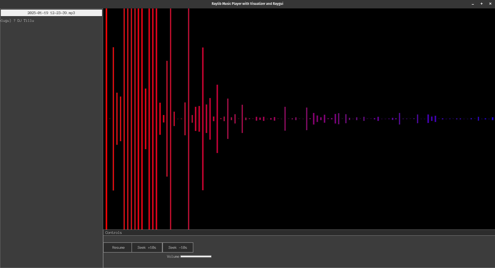
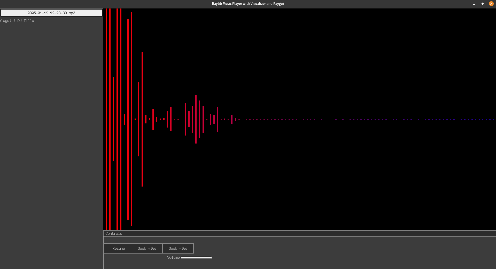

# 🎵 Music Player with Visualization 🎨

## 📖 Overview
This project is a feature-rich music player built in C. It incorporates:
- *miniaudio*: 🎧 For seamless audio playback.
- *raylib*: 🖼️ For an interactive and visually appealing graphical user interface.
- *FFTW*: ⚡ For fast and efficient FFT (Fast Fourier Transform) processing, enabling music visualizations.

Additionally, the music player includes vibrant real-time music visualizations, enhancing the listening experience.

## ✨ Features
- *Audio Playback*: 🎶 Play various audio formats effortlessly using miniaudio.
- *Music Visualizer*: 🌈 Stunning, real-time music visualizations created using FFTW and rendered with raylib.
- *User-Friendly GUI*: 🖱️ An intuitive and minimalistic interface for navigation and playback control.

## ⚙️ Installation
### 🛠️ Prerequisites
Ensure you have the following installed:
- GCC or any compatible C compiler
- [miniaudio](https://github.com/mackron/miniaudio)
- [raylib](https://www.raylib.com/)
- [FFTW](http://www.fftw.org/)

### 🌀 Installing FFTW
To install FFTW, follow these steps based on your operating system:

#### 🐧 For Debian/Ubuntu:
bash
sudo apt update
sudo apt install libfftw3-dev

#### 🐦 For Fedora:
bash
sudo dnf install fftw-devel

#### 🍎 For macOS (using Homebrew):
bash
brew install fftw

#### 🖥️ For Windows:
Download the precompiled binaries or source code from the [official FFTW website](http://www.fftw.org/) and follow the installation instructions provided there.

### 🏗️ Build Instructions
1. Clone the repository:
   bash
   git clone <repository-url>
   cd <repository-folder>

2. Install the required libraries if not already available.
3. Compile the source code:
   bash
   gcc -o music_player main.c -lraylib -lfftw3 -lpthread -lm

4. Run the program:
   bash
   ./music_player

## 🚀 Usage
- Launch the application using the terminal.
- Use the GUI to select a music file for playback.
- Enjoy the dynamic music visualizations that sync perfectly with the audio.

## 🎥 Video Preview
Below is a preview of the music player's interface and visualization capabilities. Click the image to view the full video demonstration:

## 🤝 Contributions
Contributions are welcome! Please feel free to fork the repository and submit pull requests.

## 📜 License
This project is licensed under the MIT License. See the LICENSE file for details.
